## Medboard
Medboard is a web application developed using Laravel PHP, MySQL, HTML, CSS, Bootstrap, and JavaScript. The application is designed to help healthcare providers manage patient records, care plans, and medication administration.

## Key Features and Functionality
The application includes the following features and functionality:

Admin panel for managing patient records and user accounts
Nurse panel for managing patient care and medication administration
Doctor panel for managing patient treatment plans
Admission process for admitting new patients
Demo
Here are some screenshots of the application:

## Login Page
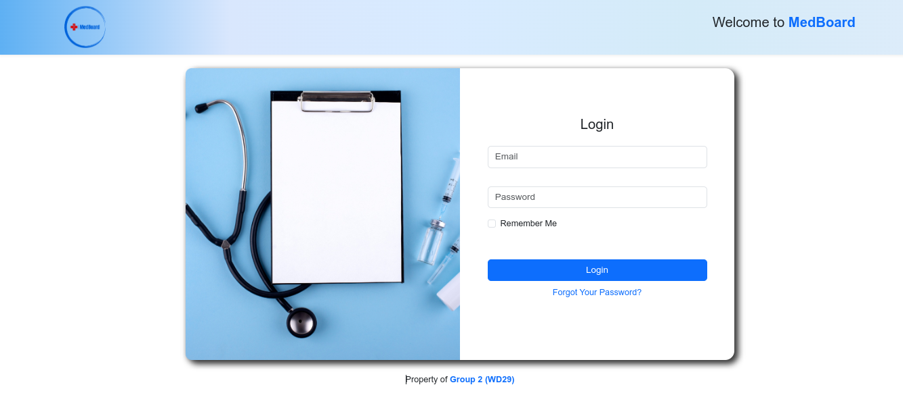

## Admin Dashboard
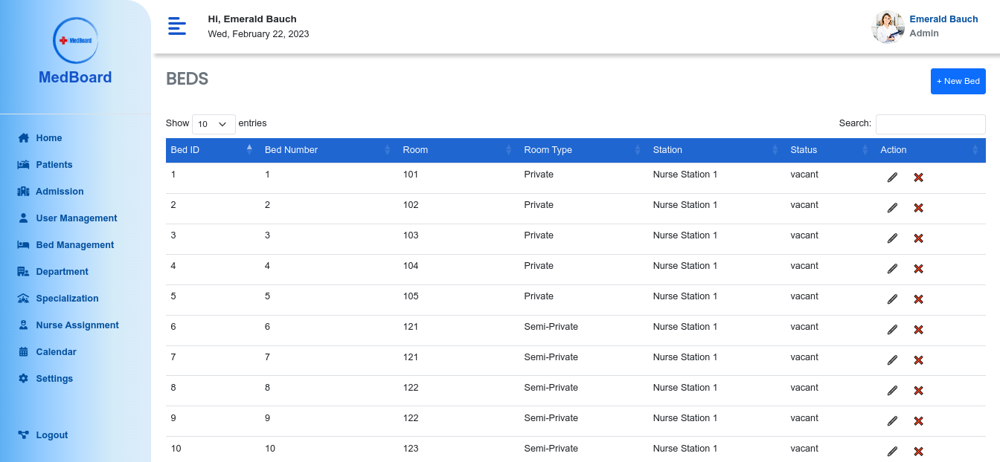
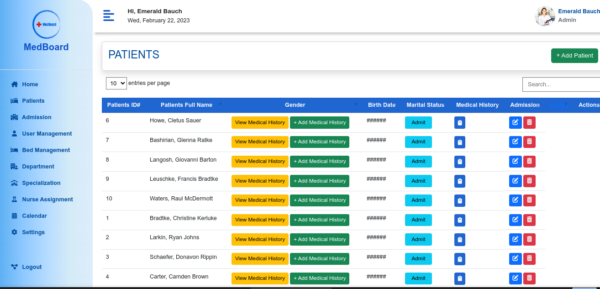

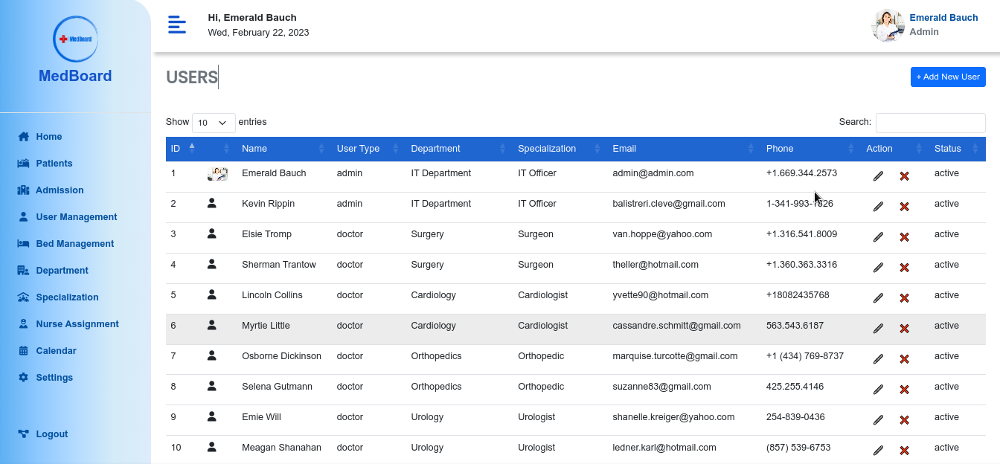
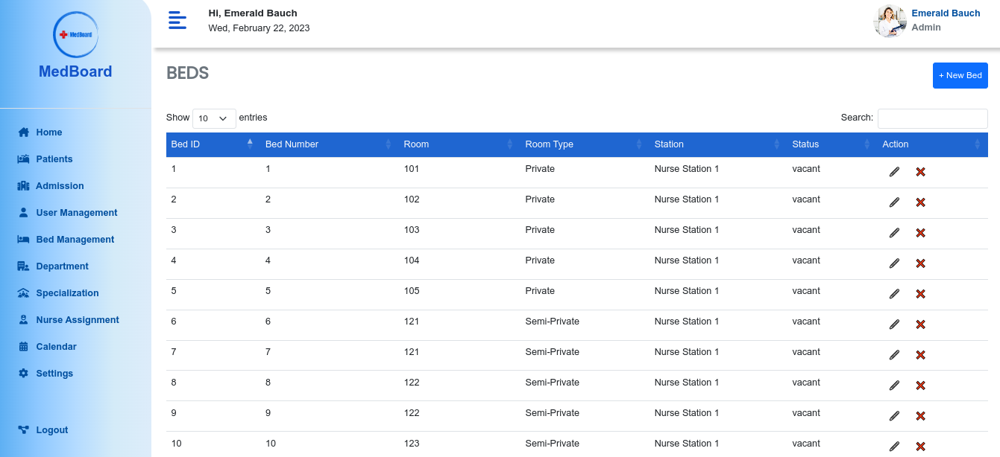
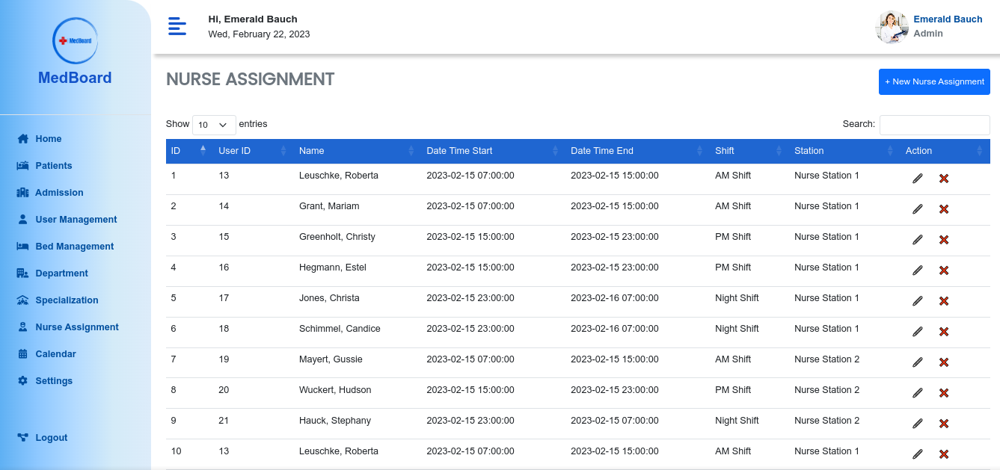
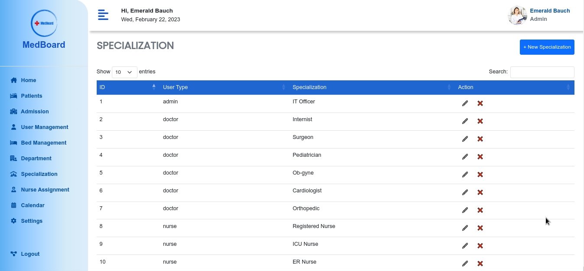
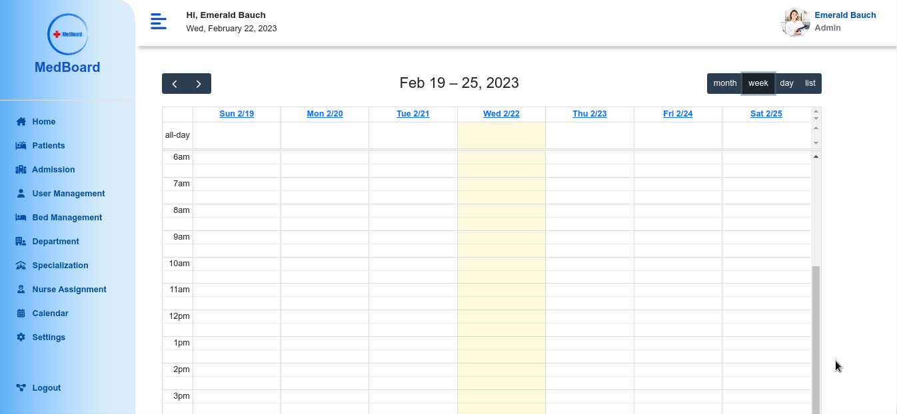

## Nurse Dashboard
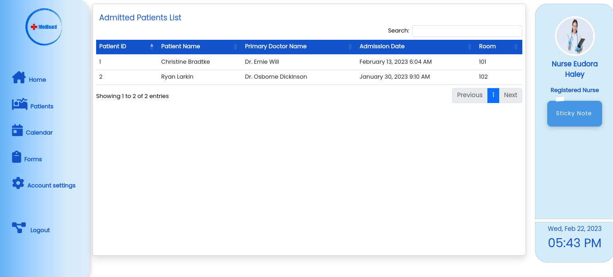
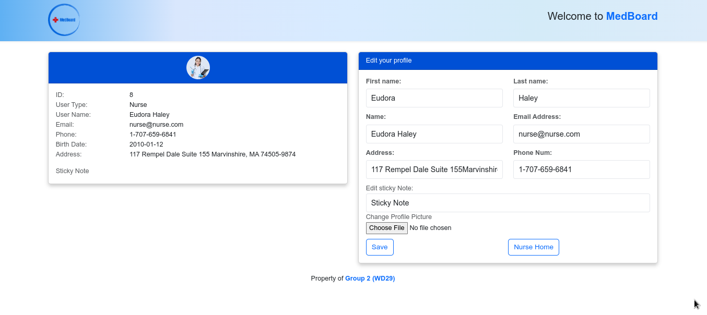

## Doctor Dashboard
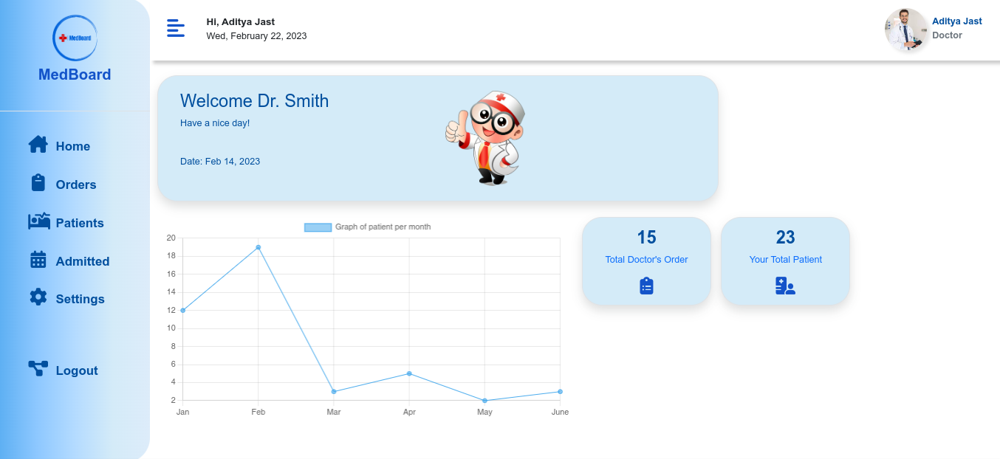
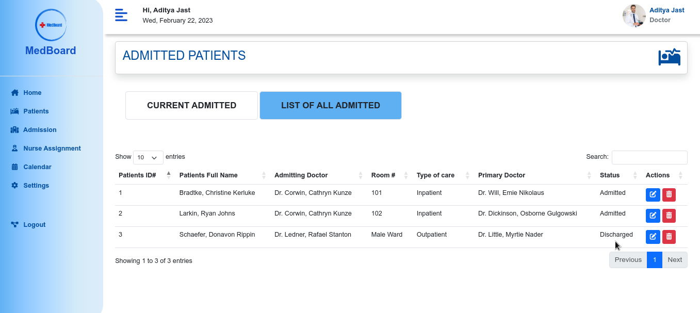

## Getting Started
To run the application locally, you will need to have PHP, MySQL, and Composer installed on your machine. Follow these steps to get started:

## Clone the repository
Run composer install to install the dependencies
Rename the .env.example file to .env and update the database settings
Run php artisan migrate to create the database tables
Run php artisan db:seed to seed the database with sample data
Run php artisan serve to start the development server
Contributing
If you would like to contribute to the project, please open an issue or submit a pull request. All contributions are welcome!

## License
This project is WD29 kode Breaker Group 2 final Capstone Project @2022-2023.

## contributor
	•jomar neri git repo https://github.com/codeace110
    //
    //
    //
    //
    //

